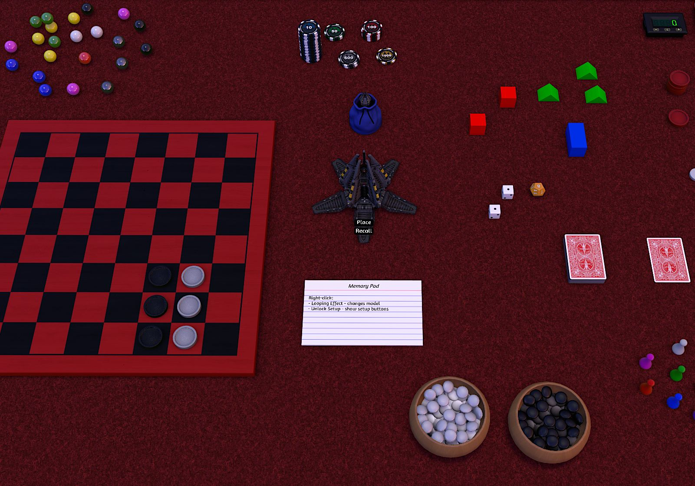

# Animated Memory Pod Memory Bag

An animated WH40k Drop Pod that lets you select items on the table, their position and rotation, and save them. From then on, you can pull those items into the bag or put them back onto the table at will.

The memory bag script was altered to show animations, reposition the buttons, and hide setup buttons in the right-click context menu to avoid interface clutter. 

## 🎮 Features

- Animated deployment
- 7 Models available
- Hides setup buttons in context menu

---

## 📚 Resources

- [Some assets and a copy of the savegame on GitHub](https://github.com/cornernote/tabletop_simulator-memory_pod)
- [Game on Tabletop Simulator Steam Workshop](https://steamcommunity.com/sharedfiles/filedetails/?id=3566739802)

---
